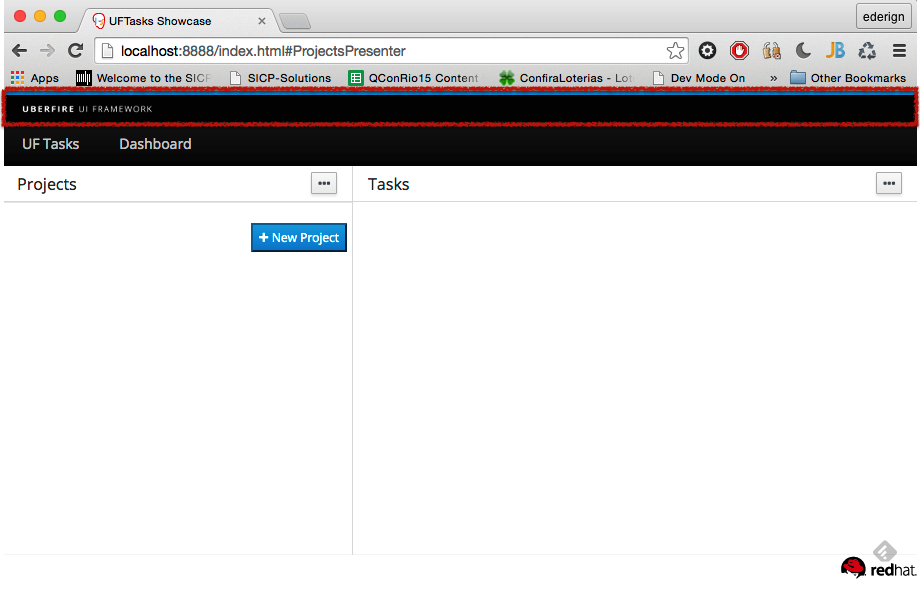
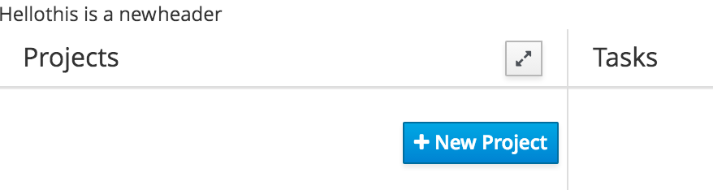

# Header
Headers in Uberfire are automatically discovered via CDI and added to the top of the Workbench screen. They stick
to the top of the viewport even when the main content area is scrolled up and down or the browser window is resized.

In order to create a header you have to create a CDI bean that implement org.uberfire.client.workbench.Header interface.



Let us add a simple Composite that adds 3 labels. 

In package org.uberfire.client.navbar we can create 

- HeaderView.java

```
package org.uberfire.client.navbar;

import com.google.gwt.user.client.ui.Composite;
import com.google.gwt.user.client.ui.HorizontalPanel;
import com.google.gwt.user.client.ui.Label;

public class HeaderView extends Composite {

    public HeaderView() {

        // Place the check above the text box using a vertical panel.
        HorizontalPanel panel = new HorizontalPanel();
        // panel.setBorderWidth(1);
        panel.setSpacing(10);
        panel.add(new Label("Hello"));
        panel.add(new Label(" this is a new "));
        panel.add(new Label("header "));

        // All composites must call initWidget() in their constructors.
        initWidget(panel);
    }
}
```

- HeaderView.html

```
<div class="container-fluid">
    <label>Tasks View</label>
</div>

```

and the update the following file
- AppNavBar.java

```

import com.google.gwt.user.client.ui.Composite;

[...]


    @Inject
    private HeaderView headerView;

    @Override
    public Widget asWidget() {
        return headerView;
    }

```
If you are using a IDE, stop the server, build and restart or if you are using command line interface:

```
$ mvn clean install
$ mvn clean gwt:run
```

and the ouput should look like this (which you can now improve): 



